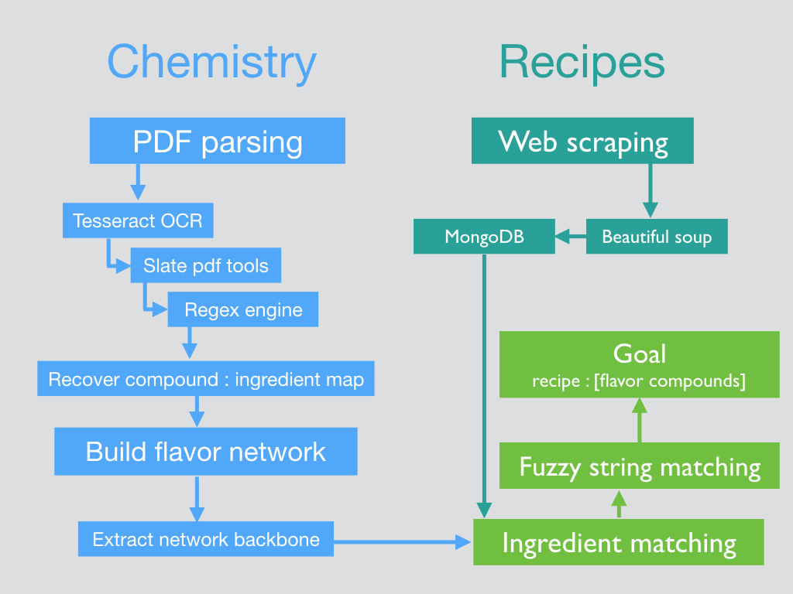
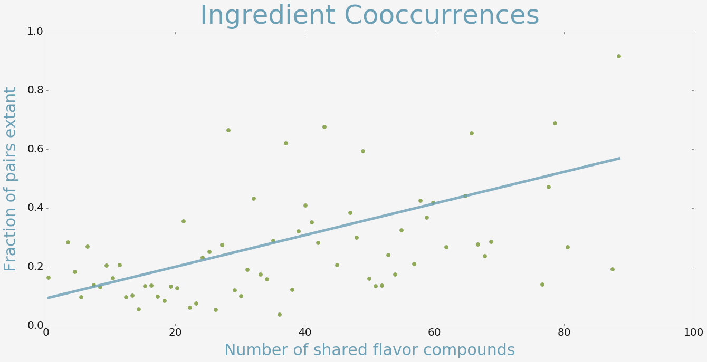

##Overview
  
We’re in the midst of a cocktail renaissance. Hoping to contribute to this recent resurgence, I’ve created MixedCompany—a tool for recommending novel ingredient pairings and substitutions in cocktails. The ingredient-flavor network latent in the world of mixed drinks contains a great deal of information about our preferences for flavor combinations. I build and exploit this network to suggest ingredients that should pair well together, but have not appeared together before in existing cocktail recipes. Interesting new twists on famous cocktail recipes, backed up by flavor data, are waiting to be explored with MixedCompany.
  

##Dataset
  

To address the question of why certain ingredients pair well together, two things are needed. The first is reference documenting the chemical compounds found in common cocktail components. For this, I used the 6th edition of Fenaroli’s handbook of flavor ingredients. Fenaroli’s handbook is the canonical reference for chemical compounds and their occurrences in nature. The second is a source of flavor pairings that human’s enjoy drinking. This is readily found in the form of cocktail recipes on the web, of which I’ve scraped nearly 2000. 

[Burdock, G. A. Fenaroli's handbook of flavor ingredients (CRC Press, 2004), 5th edn.](https://books.google.com/books?id=A8OyTzGGJhYC&printsec=frontcover&source=gbs_ge_summary_r&cad=0#v=onepage&q&f=false "Title")

[wikipedia](https://en.wikipedia.org/wiki/List_of_cocktails "Title")

[liquor.com](http://liquor.com/recipes/ "Title")

[webtender](http://wiki.webtender.com/wiki/Category%3aRecipes "Title")

[NYT drinks](http://topics.nytimes.com/top/features/magazine/columns/drink/index.html "Title")
  

##Methods
  

The path I followed was influenced in large part by the work of 
[Ahn, Ahnert, Bagrow and Barabási](http://www.nature.com/articles/srep00196 "Title") on exploring the [ingredient-flavor network](https://en.wikipedia.org/wiki/Ingredient-flavor_network 'Title') within world cuisine. 

The recipe scraping was straightforward, and the code for my scraping module can be found in 

Sanitizing the flavor and recipe data will be a major challenge for this project.

I have the flavor data in plaintext, but it is not in a tabular, searchable form. I will need to parse the document, recovering the words that I'm interested in. The OCR I've done is good, but not perfect. I will need to correct any misidentified characters in order to make the matches between flavor compounds that are the foundation of the network. NLP techniques should help here. 

  

  

Recipe scraping was straightforward, and the code for my scraping module can be found in /project modules/scrapers. Parsing the pdf of Fenaroli’s handbook was considerably more difficult. This first required extracting plaintext from the pdf using tesseract and the slate python package. Armed with the plain text, I wrote a parser to recover the compound : ingredient map that I needed to build the flavor network. This required a great deal of tinkering with regex, the result of which is realized in project_modules/flavorNetworkBuilder/parser. Sanitizing the flavor and recipe data was major challenge, but one made vastly easier by a fuzzywuzzy, a fuzzy string matching package in python. The task of building the network and performing these fuzzy matches are performed in project_modules/flavorNetworkBuilder/build_network and project_modules/flavorNetworkBuilder/recipe_weights respectively.

  

##Results
  
To test the hypothesis that ingredient pairs sharing many flavor compounds are preferred, I computed every possible pairwise ingredient combination possible from the recipe dataset. If shared compounds have no effect on occurunce in real-world recipes, we would expect to see that the fraction of pairs occuring in the wild is constant. The plot below shows the trend that is observed. As the number of shared compounds increases, the fraction of pairs at that level of sharing increases. 
  

 <b]r>

